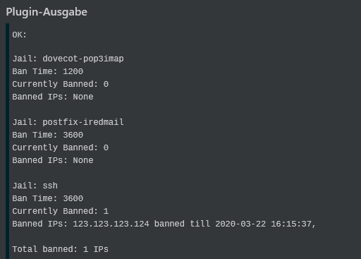
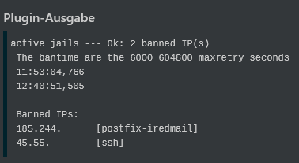
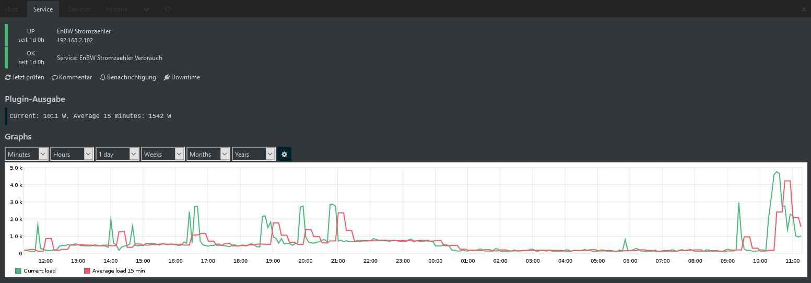

## Graphite templates
Simply copy the .ini files to your graphiteweb template folder, i.e. ```/usr/share/icingaweb2/modules/graphite/templates/```. 
Add ``vars.check_command = "strom"`` to the service definition because of obscured check_nrpe commands.
Replace ``strom`` by the required value of template.
## check_connections.sh
This check needs to be redone
## check_fail2ban
### Installation
This plugin requires fail2ban and sudo installed. Also several commands must be runnable by nagios user with sudo, so add the following to visudo:

        # Needed for check_fail2ban
        nagios  ALL=NOPASSWD: /usr/bin/fail2ban-client status
        nagios  ALL=NOPASSWD: /usr/bin/fail2ban-client status *
        nagios  ALL=NOPASSWD: /usr/bin/fail2ban-client get * bantime
### Usage    
            ./check_fail2ban -h Display this message
                             -w <warning level> defaults to 10
                             -c <crit level> defaults to 20
                             -t Time: Display until when IPs will be banned
                             -j <jaillist> i.e. comma separated string of jails, i.e. ssh,postfix
                                Only check those jails
### Examples
            ./check_fail2ban -t -w 5 -c 10 -j ssh,postfix
            ./check_fail2ban -t

### Example Output

## check_fail2ban_old.sh
This plugin is deprecated, please use check_fail2ban.sh
Forked from [Nagios Exchange](https://exchange.nagios.org/index.php?option=com_mtree&task=viewlink&link_id=4349&Itemid=74)
### Usage
/usr/lib/nagios/plugins/check_fail2ban.sh -l \<logfile\>  -p \<jail.conf\> -w 10 -c 20 \<-v\>
### Example output

## check_strom.sh
Tested and works with EnBW Stromzähler, Software Version WNGW000702
### Usage
```/usr/lib/nagios/plugins/check_strom ADDRESS```
### Output example

## check_uptime.sh
### Usage
```/usr/lib/nagios/plugins/check_uptime```
